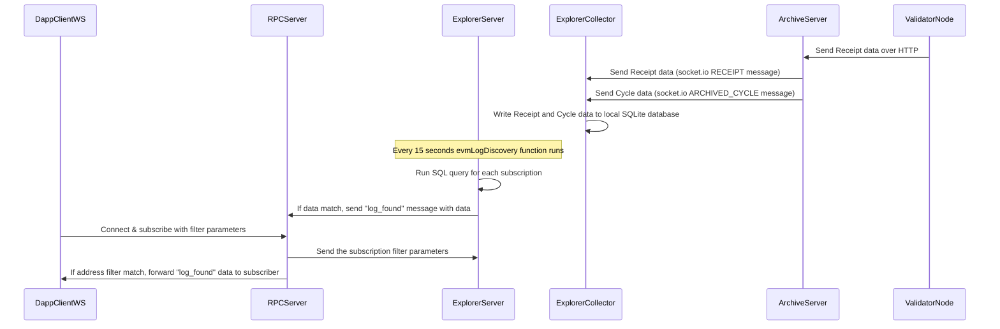
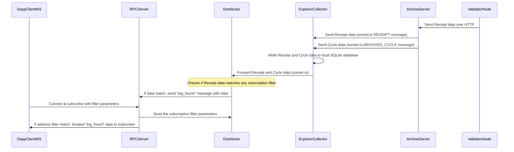

# Design1: Current System Overview

## Software Components

The system is composed of several software components, each of which is a NodeJS process. These components are:

- ValidatorNode
- ArchiveServer
- ExplorerCollector
- ExplorerServer
- RPCServer
- DappClientWS

## DappClientWS and RPCServer Interaction

DappClientWS users connect to the RPCServer with a websocket and subscribe to the RPCServer to listen for Receipts with specific address IDs. The RPCServer replies back on the websocket and sends any Receipt data back to the DappClientWS when the filter matches.

When a DappClient initializes a subscription to the RPCServer, the subscription filter parameters are also sent to an ExplorerServer.

## Receipt Data Generation and Flow

Receipt data does not originate on the RPCServer. It is generated by ValidatorNodes, which then send this data to the ArchiveServer over HTTP.

## Data Flow from ArchiveServer to ExplorerCollector

The ArchiveServer has a socket.io connection to the ExplorerCollector.

- The ExplorerCollector receives Receipt data with its socketClient on the `RECEIPT` message.
- The ExplorerCollector receives Cycle data with its socketClient on the `ARCHIVED_CYCLE` message.

The ExplorerCollector writes the above Receipt and Cycle data to a local SQLite database.

## ExplorerServer Functionality

The ExplorerServer runs a function called `evmLogDiscovery` once every 15 seconds. This function will run a SQL query for every current subscription it has to see if there is new data that it needs to forward to the RPCServer over a websocket. If there is a data match, it sends the message "log_found" that contains this data.

## Data Forwarding by RPCServer

When the RPCServer gets the "log_found" data, it inspects the addresses in the data and then forwards the data to any subscribers that have a filter that matches this data.

# Design2: Upgraded System Overview

## Software Components

The system is composed of several software components, each of which is a NodeJS process. These components are:

- ValidatorNode
- ArchiveServer
- ExplorerCollector
- Distributor (new)
- RPCServer
- DappClientWS

## DappClientWS and RPCServer Interaction

DappClientWS users connect to the RPCServer with a websocket and subscribe to the RPCServer to listen for Receipts with specific address IDs. The RPCServer replies back on the websocket and sends any Receipt data back to the DappClientWS when the filter matches.

When a DappClient initializes a subscription to the RPCServer, the subscription filter parameters are also sent to the Distributor.

## Receipt Data Generation and Flow

Receipt data does not originate on the RPCServer. It is generated by ValidatorNodes, which then send this data to the ArchiveServer over HTTP.

## Data Flow from ArchiveServer to ExplorerCollector

The ArchiveServer has a socket.io connection to the ExplorerCollector.

- The ExplorerCollector receives Receipt data with its socketClient on the `RECEIPT` message.
- The ExplorerCollector receives Cycle data with its socketClient on the `ARCHIVED_CYCLE` message.

The ExplorerCollector writes the above Receipt and Cycle data to a local SQLite database. It also forwards this data to one or more Distributors using socket.io.

## Distributor Functionality

The Distributor checks each Receipt it receives against any of the subscribed filters. If there is a data match, it sends the message "log_found" that contains this data.

## Data Forwarding by RPCServer

When the RPCServer gets the "log_found" data, it inspects the addresses in the data and then forwards the data to any subscribers that have a filter that matches this data.

# Design Update: Motivation and Overview

## Motivation for the Design Change

The primary motivation for upgrading the system is performance enhancement. The original system was built to read data from a SQL database every 15 seconds. This was a quick and useful but temporary measure that can't scale up. A large number of subscriptions could slow the ExplorerServer to a halt.

Another reason for this upgrade is to accommodate future expansion and versatility of the system. The system is expected to cater to other services that may need access to a continuous stream of Receipt or Cycle data. The newly introduced Distributor component is designed to be flexible and scalable, capable of being forked or upgraded to support these future requirements.

## Changes in the System Design

The system upgrade involves several key changes:

1. **Introduction of the Distributor**: The Distributor is a new component that takes over some of the responsibilities of the ExplorerServer. It manages subscription filters and checks incoming Receipt data for matches. When a match is found, it triggers a "log_found" message.

2. **Modification in DappClientWS and RPCServer Interaction**: Instead of sending subscription filter parameters to the ExplorerServer, the RPCServer now sends these parameters to the Distributor.

3. **Data Flow Modifications**: The ExplorerCollector now forwards Receipt and Cycle data to the Distributor using socket.io, in addition to writing the data to the local SQLite database. This change enhances the performance of the ExplorerServer and supports real-time data streaming.

4. **Changes in the ExplorerServer's Functionality**: The task of checking for new data against the current subscriptions, previously done by the ExplorerServer, is now delegated to the Distributor. This change unburdens the ExplorerServer, improving overall system efficiency.

# Task List

1. **Task 1: Code Transfer from ExplorerServer to Distributor** - This task involves moving the existing subscription mechanism from `src/subscription` in the ExplorerServer to a new microservice in the Shardeum-Explorer repo called Distributor. First, create a new file src/distributor.ts that is the entrypoint for the Distributor. Also create the folder src/distributor and place new related files in this folder. Move the RPC websocket subscription related code from the main server process to the Distributor. Look at code in src/index.ts for "evm_log_subscription" and also under src/subscription.

2. **Task 2: RPCServer Modification** - Alter the RPCServer's subscription initialization code so that it sends subscription filter parameters to the Distributor instead of the ExplorerServer. The existing mechanism for sending "log_found" back to DappClient will remain unchanged. This task can be done in parallel with Task 1.

3. **Task 3: ExplorerCollector Modification** - This task has two main components. First, implement new code in `src/collector.ts` of ExplorerCollector to forward the Cycle and Receipt data to the Distributor using socket.io, right after `collector.processData(data)` and `collector.processReceipt(data)` are called. Second, create new code in the Distributor to handle these incoming messages. The ExplorerCollector will listen on the `distributorPort` and should be able to send to one or more subscribed Distributors. Suggested filenames: `src/collector/DistributorSender.ts` for the code in ExplorerCollector to send data to Distributor, and `src/DistributorSocketListener.ts` in Distributor for receiving the data.

4. **Task 4: Distributor's "log_found" Messaging** - As the code for sending "log_found" back to the DappClient will remain unchanged, this task mainly involves integrating the new filtering mechanism developed in Task 1 into the Distributor's messaging system. This should be done after Task 1, but it can be performed in parallel with Task 3.

5. **Task 5: Testing and Debugging** - Once all the new codes are implemented and modifications are made, rigorous testing and debugging is required to ensure the new system works as expected. This task can't start until the other four tasks are completed.

Note: Tasks 1 and 4 primarily involve modifications to the Distributor and can be handled by one programmer. Tasks 2 and 3, which involve the RPCServer and the ExplorerCollector, respectively, can be handled by a second programmer. Task 5 should be a joint effort.
