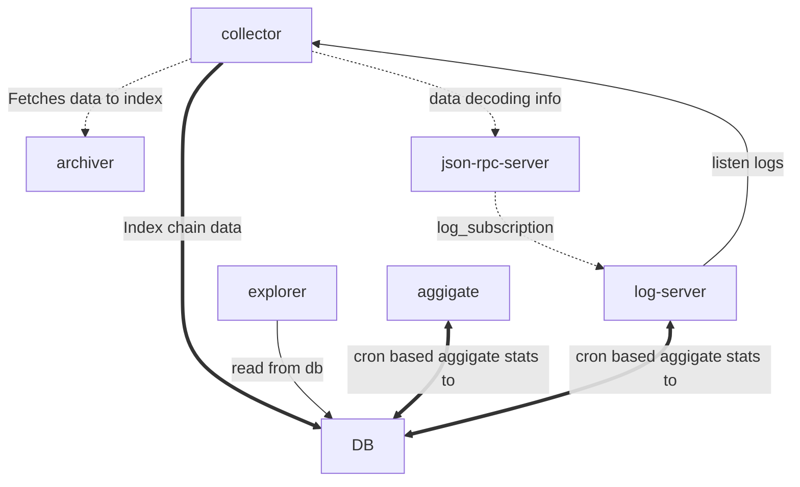

# Shardeum Explorer



## Data Collector / Indexer / API Server for the Shardeum Network

Shardeum explorer collects data from the the archiver server and indexes data and information to be searchable by different formats and exposes APIs and Web Interface.

Sharduem explorer consists of four servers.

- Collector --> collector.ts
- API and UI server --> server.ts
- RPC Data Collector --> rpc_data_server.ts
- Data Stats Aggregator --> aggregator.ts
- Log Server --> log_server.ts

Explorer server use Fastify.js and UI is developed using NextJS. For data storage, we are using `sqlite` for now.

Default port: 6001

### How to start Shardeum Explorer

```shell
npm install
```

> Add `archvier` info and `rpc` server info in the `src/config/index.ts`

```shell
npm run prepare // compile the update
```

Start the data collector server

```shell
npm run collector << OR >> pm2 start --name explorer-collector  npm -- run collector
```

Start the API and UI server. This can be run multi instances.

```shell
npm run server << OR >> pm2 start --name explorer-server npm -- run server <port>
```

View the explorer in the web

```shell
http://localhost:6001 <<OR>> http://localhost:<port>
```

Start the RPC data collector server

```shell
npm run rpc_data_server << OR >> pm2 start --name explorer-rpc-data-collector npm -- run rpc_data_server <port>
```

Start the data stats aggregator server

```shell
npm run aggregator << OR >> pm2 start --name explorer-aggregator npm -- run aggregator
```

To clean the old database.

```shell
npm run flush
```

## Docker setup

> Default NODE_ENV=production

Setup `archiverConfig.json`

- `DB_PATH=./data` to persist the databases to `./data` directory
- `NO_OF_EXPLORERS=1` (default) no of explorer service(s) to run inside container, Port will be incremented by 1 from default port which is 6001 for each explorer service replicas. (6001, 6002, 6003, ...). You can take refrence from `.env.dev` file.

```shell
echo 'DB_PATH=./data' >.env
echo 'NO_OF_EXPLORERS=2' >.env
# else
echo >.env
```

Start explore stack

```shell
# Run services in attach mode
docker compose up collector explorer log-server -d # collector, explorer server, log server
# Open localhost:6001 in browser
```

Start aggrigator after data gets synced

```shell
docker compose up aggregator -d
```

Check the logs

```shell
docker compose logs -f
```

Clean the setup

```shell
docker compose down
# clean the databases
rm -r ./data
```

## Usage endpoints

- Usage endpoints are used to count uses for each endpoint in the explorer server API
- Usage endpoints require a security key (default: *ceba96f6eafd2ea59e68a0b0d754a939*) this should be a secret key in the production servers provided by the env var **USAGE_ENDPOINTS_KEY**
  - the security key can be used in the *x-usage-key* HTTP header in the related requests, wrong or invalid keys will result in a 403 error
- The usage endpoints are:
  - POST *<host:port>/usage/enable*       **Enable the usage and start saving usage data**
  - POST *<host:port>/usage/disable*      **Disable the usage and reset usage data**
  - GET *<host:port>/usage/metrics*       **Provide usage data in the JSON format**
